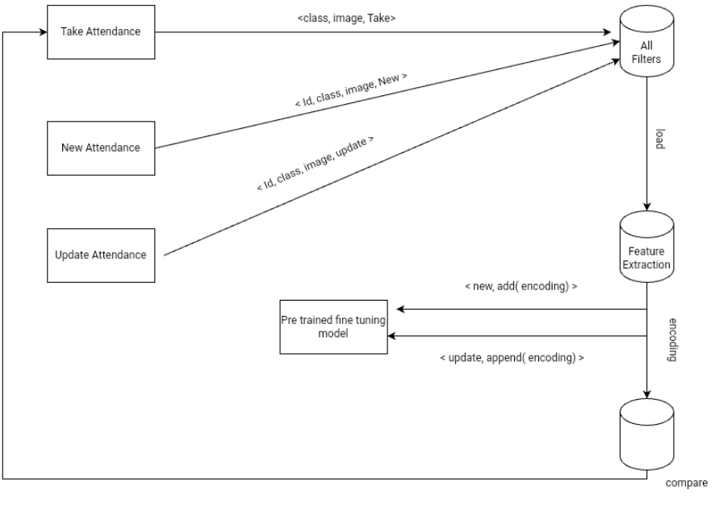

<h1>Attendance Management using Face Recognition</h1>

  <b>Attendance system using face
recognition is a procedure of recognizing students by using
face biostatistics based on the high definition of monitoring
and other computer technologies.</b> The development of this
the system is aimed to accomplish the digitization of the traditional
system of taking attendance by calling names and
maintaining pen-paper records. 

Our approach is using the world’s simplest face recognition library built using dlib’s state-of-the-art face recognition built with deep learning. This face recognition model has high accuracy ensuring low false-positive detection, efficiency, and robust. After face recognition attendance reports will be generated and stored in Excel format. 

<h1>Description</h1>

 This system used pre-trained fine-tuning model face_recognition and recognized faces by comparing face encodings 

<h1>References</h1>
Know More About The AMS 
<ul>
<li><a href="https://drive.google.com/file/d/19H9eQcFepn7br-3Xrph3rZdQvUhv4VoS/view?usp=drivesdk">Documentation (Technical Details)</a></li>
<li><a href="https://drive.google.com/file/d/1edLgPpHAH3xXXX-mTyO3mEtW9MHnhsft/view">Video (Promo)</a></li>
<li><a href="https://github.com/pvscreations/AMS_backend_django.git">Django Source Code</a></li>
</ul>
